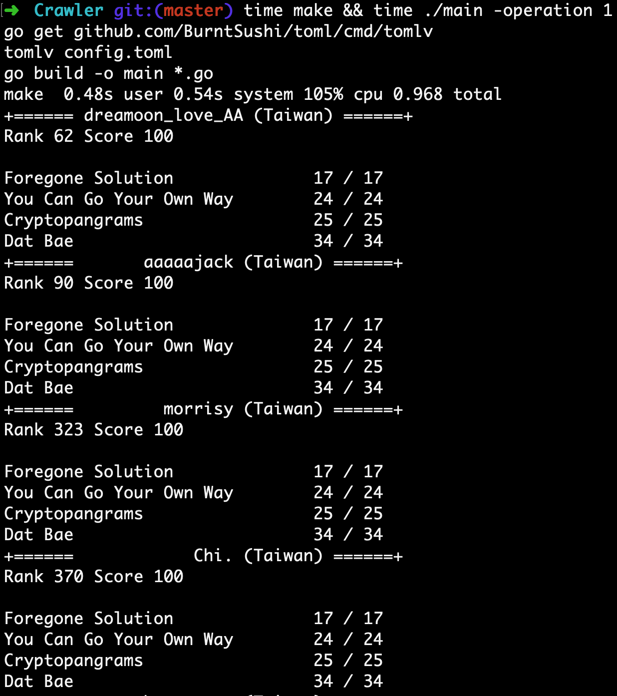

# Google-CodeJam-Scoreboard-Crawler

Since the latest Google CodeJam scoreboard doesn't have the `friend list` feature that we all liked, I decided to write one just for fun and practice.

The crawler also have the ability to show a list of contestants from a certain country!

# Demo

After configuring the `config.toml` file, we will be able to get the output like the following image.

Feel free to contribute to the project if you are interested!

